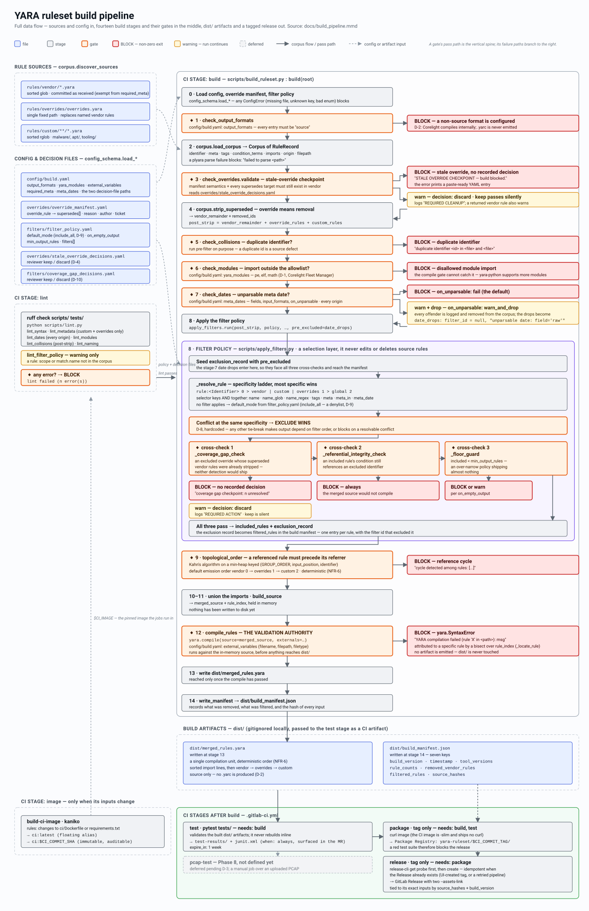

# Build pipeline diagram



The diagram above is the full data flow: rule sources and config in, the fourteen build
stages and their gates in the middle, `dist/` artifacts and the tagged release out.
`docs/build_pipeline.mmd` is the editable source; `docs/build_pipeline.svg` is the
rendered image committed for embedding.

## Legend

| Shape / colour | Meaning |
|---|---|
| Blue rectangle | A file — a rule source, a config file, or a build artifact |
| Grey rectangle | A build stage or CI job (numbered to match `build_ruleset.py: build()`) |
| Orange hexagon | A gate — a decision point that can stop the pipeline |
| Red rectangle | **BLOCK** — the run fails here, non-zero exit, no artifact emitted |
| Yellow rectangle | Warning — logged, run continues |
| Dashed grey | Deferred / not yet implemented |
| Solid arrow | The rule corpus flowing through |
| Dotted arrow | A config or decision file feeding a stage |

## The six hard gates

Every one of these exits non-zero and emits nothing.

| # | Gate | Blocks when |
|---|---|---|
| 1 | `check_output_formats` | Any configured format is not `source` (D-2) |
| 3 | `check_overrides.validate` | An override names a vendor rule that no longer exists and no reviewer decision is recorded |
| 5 | `check_collisions` | Two rules share an identifier — run **pre-filter**, since a duplicate is a source defect and makes identifier-keyed filter resolution ambiguous |
| 6 | `check_modules` | A rule imports a module outside `yara_modules`; the compile gate cannot catch this, because yara-python supports more modules than Corelight does |
| 9 | `topological_order` | A reference cycle between rules |
| 12 | `compile_rules` | YARA rejects the merged source |

Stage 7 (`check_dates`) blocks too, but only under `on_unparsable: fail`; under
`warn_and_drop` it warns and drops the offending rules instead.

Inside stage 8 the filter engine adds three more: the coverage-gap checkpoint,
referential integrity, and the output floor.

## The two reviewer checkpoints

Both are deliberately manual (D-4, D-10). An unresolved entry is *always* a hard block —
the pipeline will not guess.

| Checkpoint | Detected at | Decision recorded in |
|---|---|---|
| Stale override | stage 3, `check_overrides.validate` | `overrides/stale_override_decisions.yaml` |
| Coverage gap | stage 8, `_coverage_gap_check` | `filters/coverage_gap_decisions.yaml` |

`keep` proceeds silently; `discard` proceeds with a cleanup warning; no entry blocks.
Both error messages print a paste-ready YAML entry.

## Why the stage order is what it is

Three orderings in the diagram are load-bearing rather than incidental:

- **Override strip (4) before the collision check (5).** A superseded vendor identifier
  reused by its replacement is not a collision — checking first would flag it falsely.
- **Date drops (7) after the strip and the collision/module gates, before filters (8).**
  Dropping after the strip stops a dropped vendor rule from spuriously making an override
  stale, which is an unconditional hard block. Dropping after the collision and module
  gates stops a drop from masking a source defect. Seeding the drops into the filter
  engine via `apply_filters.run(pre_excluded=…)` then puts them through the same three
  cross-checks as any filter exclusion, and lands them in the manifest's `filtered_rules`
  with a null `filter_id`.
- **Compile (12) before any write (13).** The compile runs against the in-memory merged
  source, so an artifact that has not compiled can never reach `dist/`.

## Regenerating the SVG

After editing `docs/build_pipeline.mmd`, re-render and commit both files together.

```fish
# fish
docker run --rm -u (id -u):(id -g) -v (pwd):/data minlag/mermaid-cli:11.4.2 \
  -i docs/build_pipeline.mmd -o docs/build_pipeline.svg -b white
```

```bash
# bash / zsh
docker run --rm -u "$(id -u):$(id -g)" -v "$PWD":/data minlag/mermaid-cli:11.4.2 \
  -i docs/build_pipeline.mmd -o docs/build_pipeline.svg -b white
```

With a local Node toolchain instead:

```bash
npx -y @mermaid-js/mermaid-cli@11.4.2 \
  -i docs/build_pipeline.mmd -o docs/build_pipeline.svg -b white
```

`-b white` is deliberate. GitLab and GitHub render the docs in light or dark theme, but
neither applies the viewer's theme to an embedded SVG's text. An opaque light background
keeps every label legible in both, which a transparent one does not.

> **Note.** The committed `build_pipeline.svg` was authored by hand to the same content as
> the `.mmd`, because no mermaid renderer was available at the time — mermaid's automatic
> layout will place things differently. Re-rendering with the command above replaces it
> with the mermaid layout, which is the intended long-term state; the two files are
> equivalent in content, not pixel-for-pixel.
